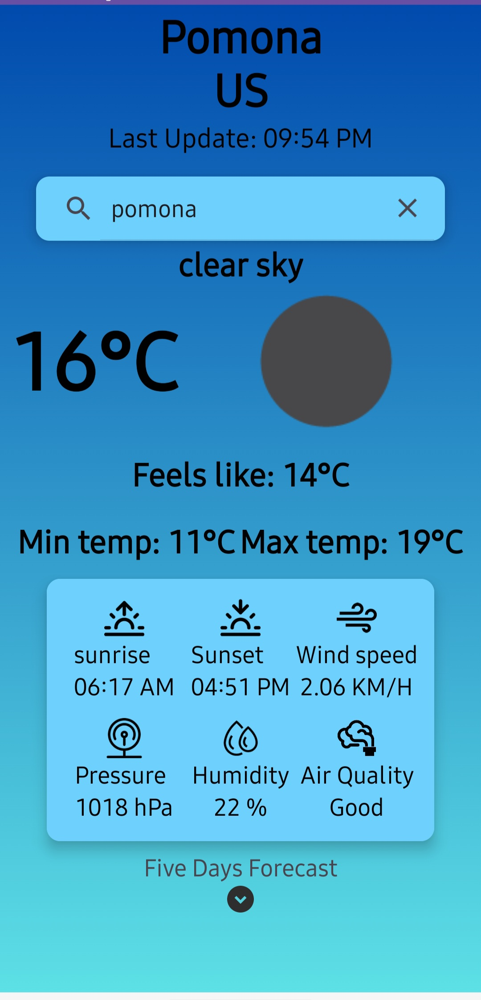

#### Weather App | Open Weather Api | Retrofit & Kotlin Coroutines | FusedLocation 

#### API Call is 5 Days/3 hours Forecast 

1. Search Weather By Current Location | FusedLocation 
2. Search Weather By City 
3. Air Quality Graph

###### For today's forecast we get the system's current date and filter out the objects that contain the weather of today and store them in a today's weather list 

###### If the timestamp in today's forecast list matches or is the nearest to current time then we display that weather object as current weather 

###### For upcoming forecast we presented it in THREE-hours interval for the next five days of a specific location. 

###### Shared Preferences have played an important role where I store search query (city name) and when the app exits, shared preference gets cleared

##### Images

